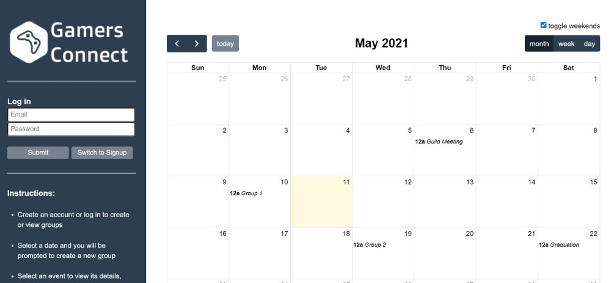

# Gamers Connect Documentation
## Purpose
Many online games require coordination between players to form groups. In addition, gamers enjoy discussing the games they are playing with others. Most related software solutions focus on business-driven collaboration, but do not appeal to gamers and do not focus on simplicity. In response to this need, we will create a web application that connects gamers via a user-friendly calendar interface. The target users for this gaming group finder system include players of both offline and online video games who wish to collaborate with other gamers. Users are also expected to have limited time frames in which they can play games, desire simplicity in their applications, and would like to find others with similar availability. Gamers Connect is a website that allows users to create events and share them with others. The application utilizes node.JS, graphQL, React, MongoDB and FullCalendar.

## Outcome & Demo
Presented below is the visual outcome of the application. To view a demo, click the image to be linked to a demo video or click [here](https://drive.google.com/file/d/15l-53ieQXSnqWF0q_TOJAwSKO6rTXb_t/view?usp=sharing).


[](https://drive.google.com/file/d/15l-53ieQXSnqWF0q_TOJAwSKO6rTXb_t/view?usp=sharing)

## Developers

- AJ Jones - Responsible for back-end development.
- Eric Levas - Responsible for front-end development.

## Downloads 
First download the following:

 - https://code.visualstudio.com/
 - https://nodejs.org/en/
 - https://desktop.github.com/ (Optional, command line git will also work)

## Installation
First install Visual Studio Code, and Node.js.
Once you have them both installed, open up a Command Line or terminal.

Run the following command to update NPM  (Node Package Manager) to support NPX.

   ```
npm install -g npm
```

This will allow you to create react apps directly, but you should be able to pull ours from the repo.

You may also want to navigate to the extensions in VS Code, and install the "Node Debug" extension for debugging support.
https://marketplace.visualstudio.com/items?itemName=ms-vscode.node-debug2

Finally, install GitHub desktop.
Once installed, open, and select File> Clone Repository.
You will need to log in with your GitHub user information, and you will see the project listed below "Your Repositories".

If you don't see it there, select "URL", and paste the following.
https://github.com/Aj-Jones/CS441Project

If you don't have access to the repo, please let me know.

Once the repository clones, you are setup!

## Dependencies
Dependencies required to run this program can be found in the package.json files in both client and server directories.

Dependencies can be downloaded by opening a console window in both the client and server directories and typing the following:
```bash

npm install # installs all dependencies for the particular directory

```

## Configuration
Create a file in the root directory of the repo called 
nodemon.json
Paste the following code inside.
```
{
    "env":{
        "MONGO_USER": "insert Username Here",
        "MONGO_PASSWORD": "insert Password Here",
        "MONGO_DB": "myFirstDatabase"
    }
}
```
Populate the fields with your mongo information.
This will allow us to use these environment variables rather than hardcoded values.
We will setup usernames and passwords at our next meeting.

## Running the Program
Open a console window in the server directory, and a separate console window in the client directory, typing the following in both:
```bash

npm start # builds and opens a web browser

```
After both the client and server are running, the web application can be accessed from your local machine at http://localhost:8080/

## Instructions for Use

## Project Management 
Ensure that we follow git flow branching structure


We will be primarily pushing to feature branches, and consolidating on Develop.
Master will only be used for stable "release" versions.